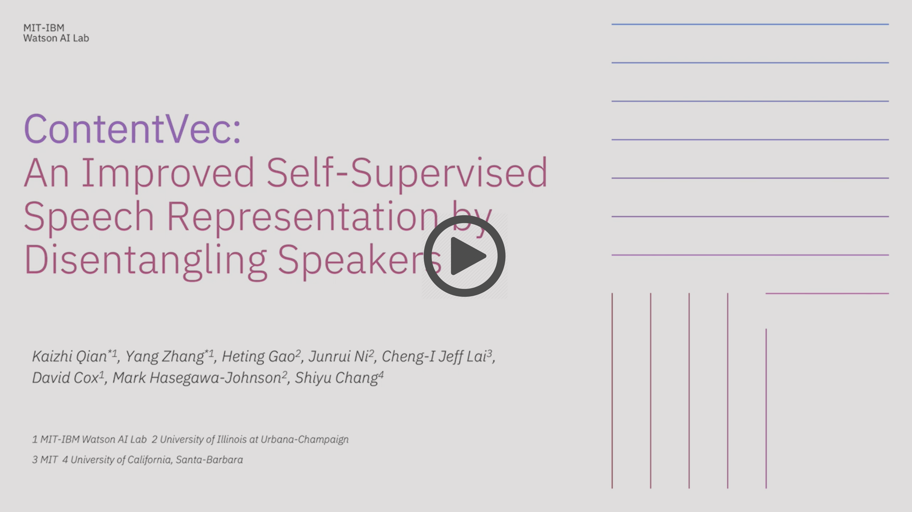

# ContentVec: An Improved Self-Supervised Speech Representation by Disentangling Speakers 

This repository provides the official PyTorch implementation of [ContentVec](https://arxiv.org/abs/2204.09224).

This is a short video that explains the main concepts of our work. If you find this work useful and use it in your research, please consider citing our paper.

[](https://youtu.be/aiGp1g-dCY4)

## Cite this paper
https://proceedings.mlr.press/v162/qian22b.html


## Pre-trained models
The legacy model only contains the representation module, which may be loaded using plain fairseq installation without setting up this code repo.

|Model | Classes |  |
|---|---|---|
|ContentVec_legacy | 100 | [download](https://ibm.box.com/s/t76fff0dciyjqt1db03y48323qp99bg9)
|ContentVec | 100 | [download](https://ibm.box.com/s/oxly542k5v3bhkfw6g8esatxziarymam)
|ContentVec_legacy | 500 | [download](https://ibm.box.com/s/z1wgl1stco8ffooyatzdwsqn2psd9lrr)
|ContentVec | 500 | [download](https://ibm.box.com/s/nv35hsry0v2y595etzysgnn2amsxxb0u)


## Load a model
```
ckpt_path = "/path/to/the/checkpoint_best_legacy.pt"
models, cfg, task = fairseq.checkpoint_utils.load_model_ensemble_and_task([ckpt_path])
model = models[0]
```
For detailed feature extraction steps, please refer to [Hubert](https://github.com/facebookresearch/fairseq/blob/main/examples/hubert/simple_kmeans/dump_hubert_feature.py).


## Train a new model
### Data preparation
Download the [zip file](https://ibm.box.com/s/zeyr94mkfs2g896oug31ml0gxv5ny43y) consisting of the following files:
- `{train,valid}.tsv` waveform list files in metadata
- `{train,valid}.km` frame-aligned pseudo label files in labels
- `dict.km.txt` a dummy dictionary in labels
- `spk2info.dict` a dictionary mapping from speaker id to speaker embedding in metadata

Modify the root directory in the `{train,valid}.tsv` waveform list files

### Setup code repo
Follow steps in `setup.sh` to setup the code repo

### Pretrain ContentVec
Use `run_pretrain_single.sh` to run on a single node

Use `run_pretrain_multi.sh` and the corresponding slurm template to run on multiple GPUs and nodes
